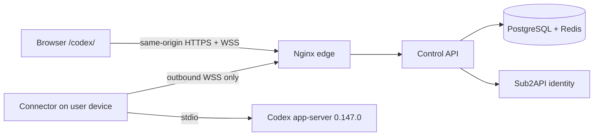

<p align="center">
  
</p>

<h1 align="center">Sub2API Codex Control</h1>

<p align="center">
  Securely use your own Codex installation from a browser, without opening a port on the device.
</p>

<p align="center">
  <a href="README.zh-CN.md">简体中文</a> ·
  <a href="#user-quick-start">Quick start</a> ·
  <a href="https://github.com/peter2317238492/sub2api-codex-control/releases">Releases</a> ·
  <a href="docs/installation.md">Installation</a> ·
  <a href="docs/usage.md">User guide</a> ·
  <a href="docs/operations.md">Operations</a> ·
  <a href="SECURITY.md">Security</a>
</p>

<p align="center">
  <a href="https://github.com/peter2317238492/sub2api-codex-control/actions/workflows/ci.yml"></a>
  
  
  
  <a href="LICENSE"></a>
</p>

> [!IMPORTANT]
> This repository currently contains a **source release candidate**. No signed
> production Release or supported installer has been published yet. Do not use
> a mutable checkout, an ad hoc binary, or an unsigned image as a production
> release. Follow the release notes only after an immutable tagged Release
> appears on GitHub.

## Downloads

All supported downloads will be published on the repository's
[GitHub Releases page](https://github.com/peter2317238492/sub2api-codex-control/releases).
That page is intentionally empty while this source candidate is under review.

| Audience | Release tag | Supported path |
| --- | --- | --- |
| Ordinary users | `connector-v*` | Prefer the package and SHA-256 shown by the Control PWA; the same signed `.deb`, `.rpm`, or notarized `.pkg` must exist in the matching GitHub Release |
| Server operators | `control-v*` | Download the online or offline server package and its evidence, then follow the [formal deployment procedure](docs/runbooks/deployment.md) |

Never install GitHub's automatically generated **Source code** archives as a
production package. If the PWA metadata, release tag, filename, or SHA-256 do
not agree exactly, stop rather than substituting another asset.

## At a glance

| | Description |
| --- | --- |
| **Problem solved** | View and control Codex on your own device from a browser on another computer or phone |
| **Connection model** | The user device makes an outbound WSS connection and opens no inbound port |
| **Who can use it** | Every signed-in Sub2API user, isolated to their own devices and threads |
| **Who configures it** | A Sub2API operator enables the site once; users then configure, pair, use, and revoke their own devices after native package installation |
| **Security boundary** | Eight fixed RPCs, workspace allowlists, sandbox caps, and expiring approvals; no raw remote shell |
| **Platforms** | Connector supports Linux `amd64` / `arm64` and macOS Intel / Apple silicon; Windows is not supported yet |

## What it is

Sub2API Codex Control is a self-hosted, same-origin control plane for
user-owned Codex installations. It combines three small components:

| Component | Runs on | Responsibility |
| --- | --- | --- |
| **Control PWA** | Browser | Devices, threads, streamed turns, approvals, and revocation |
| **Control API** | Sub2API server | Short-lived sessions, user isolation, durable dispatch, and audit state |
| **Connector** | Your Codex device | Outbound WSS connection and a pinned `codex app-server` child over stdio |

The Connector does not open an inbound device port and does not modify Codex
configuration, authentication files, workspaces, plugins, or shell profiles.
Every ordinary Sub2API user owns and manages their own devices; configuration,
pairing, use, and revocation do not require a Sub2API administrator. Installing
the system package may still require local `sudo` or macOS administrator approval.



## Highlights

- **Self-service devices.** An authenticated user can select the matching
  Connector package, copy the local initialization command, pair a device, and
  revoke it without Sub2API operator assistance after any local package approval.
- **Eight typed operations only.** Remote access is limited to `model/list`,
  `thread/start`, `thread/list`, `thread/read`, `thread/resume`, `turn/start`,
  `turn/steer`, and `turn/interrupt`.
- **Fail-closed approvals.** Command, file-change, and permission approvals are
  scoped, one-shot, epoch-bound, revocable, and denied on timeout or disconnect.
- **Local workspace control.** The formal management command admits one
  device-owned workspace and fixes the current sandbox ceiling at
  `workspace-write`; direct expansion is rejected.
- **No raw remote shell.** Shell, exec, arbitrary filesystem/process access,
  config changes, account login, plugin installation, and raw RPC pass-through
  are rejected before Codex dispatch.
- **Release and recovery gates.** The repository includes signed-source,
  immutable-image, backup/restore, datastore-isolation, rollback, and
  observability tooling for production operators.

## User Quick Start

This flow applies after a signed `connector-v*` Release is published and your
Sub2API operator has enabled Control.

Before starting, have a signed-in Sub2API account, a Linux or macOS device with
the exact supported Codex CLI, at least one absolute workspace path, and
outbound TCP 443 access to the site. You do not need a Sub2API administrator to
create a device, issue a pairing code, or edit Connector configuration for you.
Native package installation may prompt for local `sudo` or macOS administrator
approval; that local authorization is separate from Sub2API administration.

### 1. Sign in

Sign in to Sub2API at the normal site root, then open the Control PWA on the
same origin:

```text
https://your-sub2api.example/codex/
```

Control exchanges the current Sub2API access session for a short-lived
HttpOnly session. Your Sub2API refresh credential is not sent to Control.

### 2. Download, verify, and install

Click the download icon in the device rail, or select **Install Connector** in
the empty state. Choose the package for your operating system and architecture,
download it, and run the checksum-and-install command shown by the PWA. Do not
install the package unless its SHA-256 matches exactly.

| Platform | Supported package | Install with |
| --- | --- | --- |
| Debian / Ubuntu `amd64`, `arm64` | `.deb` | `sudo apt install ./sub2api-codex-connector_*.deb` |
| Fedora / RHEL `amd64`, `arm64` | `.rpm` | `sudo dnf install ./sub2api-codex-connector_*.rpm` |
| macOS `amd64`, Apple silicon | signed and notarized `.pkg` | `open ./sub2api-codex-connector_*.pkg` |

The PWA shows an exact filename and checksum command. Linux package installation
uses local `sudo`; macOS Installer may request a local administrator credential.
No Sub2API administrator needs to create or pair the device.

Run Connector commands as the ordinary user who owns Codex and the workspace,
not as `root`.

### 3. Create private configuration

The formal wizard initializes one workspace. Fill in the device name and
absolute workspace path in the PWA, then run the displayed command as the
ordinary Codex user to create a mode-`0600` private configuration:

```sh
sub2api-codex-connector-ctl init \
  --origin https://your-sub2api.example \
  --workspace /absolute/path/to/workspace \
  --display-name "My workstation"
```

The configuration path is fixed at
`$HOME/.config/sub2api-codex-connector/connector.json` so interactive commands
and the user service always use the same file. A non-empty `XDG_CONFIG_HOME`
override is rejected.

The management command binds this file to a private v2 layout with its SHA-256.
Do not edit it in place. This formal command currently supports one workspace
per Connector. To change that workspace, revoke the device in the PWA, stop and
purge the managed state, then run `init`, `pair`, and `start` again. Direct
multi-root and sandbox-cap changes are not supported yet.

### 4. Pair and claim the device

```sh
sub2api-codex-connector-ctl pair
```

`pair` reports the path of a mode-`0600` file containing a one-time code. Keep
the command running, select **Pair existing Connector** in the PWA, enter the
16-character code, and wait until the command confirms the claim and exits. Do
not paste the code into chat, logs, or an issue.

### 5. Start the service

Only after `pair` has confirmed the browser claim, start the background service
as the same ordinary user:

```sh
sub2api-codex-connector-ctl start
sub2api-codex-connector-ctl status
```

The package installs a user-level `systemd` service on Linux or a `launchd`
agent on macOS. It preserves existing Codex files during install and upgrade.

### 6. Control Codex

1. Select an online device.
2. Create a thread inside one of its allowed workspace roots.
3. Select a model and send text input.
4. Review each approval request; stale or unanswered requests are denied.
5. Steer or interrupt the active turn, resume a managed thread, or archive an
   idle thread from the PWA.

## Interface tour

| Area | Purpose |
| --- | --- |
| Header | See live connection state, open pending approvals, renew the session, or sign out |
| Device rail | Install or pair a Connector, switch devices, see status, and revoke a device |
| Thread list | Search, create, select, and archive managed threads for the selected device |
| Conversation | Send a message; typing while running steers the turn; the stop button interrupts it |
| Approval drawer | Review origin, type, details, and expiry before approving or denying a one-shot request |

## Everyday Commands

```sh
# Show the private configuration path
sub2api-codex-connector-ctl config-path

# Service lifecycle
sub2api-codex-connector-ctl start
sub2api-codex-connector-ctl stop
sub2api-codex-connector-ctl restart
sub2api-codex-connector-ctl status

# Recent user-service logs
sub2api-codex-connector-ctl logs
```

To retire a device, revoke it in the PWA first. Native package removal deletes
only package-owned files and preserves the user's private Connector state. The
user may explicitly remove that retained state afterward:

```sh
sub2api-codex-connector-ctl purge-user-state --yes
```

For a v2 managed configuration, that command refuses root execution and
revalidates the recorded configuration SHA-256, ownership, permissions,
symlinks, and every configuration/state/workspace/`CODEX_HOME` overlap before
deleting the two Connector-owned directories. It refuses legacy configurations
without a verified layout instead of guessing what is safe to delete.

## Troubleshooting

| Symptom | Check |
| --- | --- |
| PWA returns to Sub2API | Sign in at `/` first, then reopen `/codex/` on the same host. |
| Pairing does not complete | Keep `connector-ctl pair` running; check system time, HTTPS origin, outbound WSS, and code expiry. |
| Codex version is rejected | Install exactly `codex-cli 0.147.0`; protocol drift is intentionally blocked. |
| Managed configuration changed | Do not edit `connector.json`; revoke the device, then stop, purge, and re-initialize it. |
| Legacy service binding is missing | Run `sub2api-codex-connector-ctl start` once as the ordinary Codex user so the unchanged legacy configuration can be bound to the current absolute Codex path. |
| `XDG_CONFIG_HOME` is rejected | Back up the old configuration and its referenced state, copy it without overwriting to the fixed path with directory mode `0700` and file mode `0600`, then unset the override; follow the migration procedure in the installation guide. |
| Workspace is rejected | Use an existing absolute path outside Connector state and `CODEX_HOME`. |
| Device is offline | Run `connector-ctl status` and `connector-ctl logs`; verify outbound TLS access. |
| Approval disappeared | It expired, was already resolved, belonged to another user, or became stale after reconnect. |

See the complete [usage guide](docs/usage.md) for first-time setup, daily use,
approvals, recovery, archiving, revocation, logout, and the remote data boundary.

## User and operator boundary

| Ordinary users handle | Server operators handle |
| --- | --- |
| Downloading the matching Connector and creating private configuration | Deploying and upgrading the Control services |
| Initializing the single allowed workspace with the current `workspace-write` ceiling | TLS, Nginx, database, and Redis isolation |
| Pairing, starting, diagnosing, and revoking their own devices | Publishing and signing trusted packages and images |
| Threads, turns, approvals, interruption, and archiving | Backups, restore rehearsals, rollback, and monitoring |

Normal use never requires a Sub2API operator to access a user's device, Codex
login, workspace contents, or pairing code. Native package installation remains
a local operating-system authorization step where the platform requires it.

## For Server Operators

Production is deliberately not a one-command Compose deployment. Operators
must use the verified server package and satisfy the admission gates for the
exact release:

1. immutable Sub2API and Control image identities;
2. a fresh root-only backup and isolated restore rehearsal;
3. dedicated PostgreSQL ownership and authenticated, prefixed Redis ACLs;
4. same-origin Nginx/TLS routes and loopback-only service bindings;
5. signed source, image lock, SBOM, provenance, and rollback evidence;
6. authenticated browser/device acceptance and alert-delivery evidence.

Start from the matching signed `control-v*` entry on the
[Releases page](https://github.com/peter2317238492/sub2api-codex-control/releases),
authenticate and extract it as described by the
[deployment runbook](docs/runbooks/deployment.md). Then use the
[backup and rollback](docs/runbooks/backups-and-rollback.md) and
[observability](docs/runbooks/observability.md) runbooks. Direct migration,
direct `docker compose up`, and deployment from a checkout bypass required
controls and are not supported production paths.

## Development

Prerequisites: Node.js 22+, pnpm 11+, Python 3.12+, Go 1.24+, Docker with
Compose v2, PostgreSQL 16+, Redis 7+, and Codex CLI `0.147.0`.

```sh
git clone https://github.com/peter2317238492/sub2api-codex-control.git
cd sub2api-codex-control
pnpm install
pnpm dev
```

The disposable full-stack harness builds the real Connector but uses a mock
Sub2API authority and a protocol-faithful fake Codex app-server. Its result is
development evidence, not production acceptance:

```sh
install -d -m 0700 "$HOME/.local/state/sub2api-codex-control/e2e-reports"
CONTROL_E2E_REPORT_DIR="$HOME/.local/state/sub2api-codex-control/e2e-reports" \
  ./tests/e2e/run-local.sh
```

## Repository Map

```text
apps/control-api/          FastAPI control plane
apps/pwa/                  Vue 3 same-origin PWA
connector/                 Go outbound-only Connector
connector/packaging/       Native package and service definitions
packages/control-protocol/ Shared wire types and policy
packages/appserver-schema/ Pinned Codex 0.147.0 schema
migrations/                Alembic database migrations
deploy/                    Release, deployment, backup, and monitoring tools
tests/e2e/                 Disposable system acceptance harness
docs/                      User, operator, contract, and security documentation
```

## Documentation

| Audience | Guide |
| --- | --- |
| Users | [Installation](docs/installation.md) · [Usage](docs/usage.md) |
| Server operators | [Operations](docs/operations.md) · [Production runbooks](docs/runbooks/README.md) |
| Release operators | [Connector release policy](connector/release/README.md) · [Control release policy](deploy/release/README.md) |
| Security reviewers | [Threat model and ADRs](docs/adr/) · [Version matrix](docs/runbooks/version-matrix.md) |
| Contributors | [Contributing](CONTRIBUTING.md) · [Security policy](SECURITY.md) |

## Security and License

Please report vulnerabilities through GitHub private vulnerability reporting as
described in [SECURITY.md](SECURITY.md). Never include credentials, pairing
codes, private paths, production logs, or user data in a public issue.

Licensed under the [Apache License 2.0](LICENSE). Third-party attribution is in
[NOTICE](NOTICE) and [THIRD_PARTY_NOTICES.md](THIRD_PARTY_NOTICES.md). This is
an independent community project and is not affiliated with, endorsed by, or
sponsored by OpenAI or the Sub2API project.
