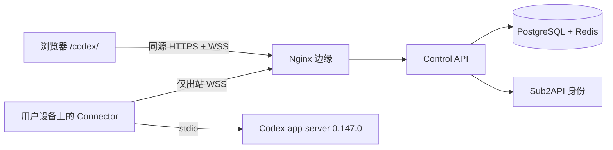

<p align="center">
  
</p>

<h1 align="center">Sub2API Codex Control</h1>

<p align="center">
  无需在设备上开放入站端口，通过浏览器安全使用自己的 Codex。
</p>

<p align="center">
  <a href="README.md">English</a> ·
  <a href="docs/installation.zh-CN.md">安装指南</a> ·
  <a href="docs/usage.zh-CN.md">使用手册</a> ·
  <a href="docs/operations.zh-CN.md">运维指南</a> ·
  <a href="SECURITY.md">安全策略</a>
</p>

<p align="center">
  
  
  
  <a href="LICENSE"></a>
</p>

> [!IMPORTANT]
> 当前仓库发布的是**源码候选版**，尚未发布正式签名的 GitHub Release 和受支持安装包。
> 不要把可变工作区、自行构建的二进制或未签名镜像当作生产版本。只有 GitHub 出现不可变
> 标签 Release 后，才应按对应发布说明安装。

## 项目介绍

Sub2API Codex Control 是与 Sub2API 同源部署的自托管 Codex 控制平面，由三个小型组件组成：

| 组件 | 运行位置 | 职责 |
| --- | --- | --- |
| **Control PWA** | 浏览器 | 设备、线程、流式对话、审批与撤销 |
| **Control API** | Sub2API 服务器 | 短期会话、用户隔离、可靠派发与审计状态 |
| **Connector** | 用户的 Codex 设备 | 仅出站 WSS，并通过 stdio 启动固定版本的 `codex app-server` |

Connector 不开放设备入站端口，也不会修改 Codex 配置、登录凭据、工作区、插件或 shell
配置。每个普通 Sub2API 用户都拥有并管理自己的设备；日常安装、配置、配对、使用和撤销
不需要管理员协助。



## 核心能力

- **普通用户自助管理。** 登录后可在 PWA 选择安装包、生成私密配置、配对并撤销自己的设备。
- **只允许八类操作。** 远程仅开放 `model/list`、`thread/start`、`thread/list`、
  `thread/read`、`thread/resume`、`turn/start`、`turn/steer` 和 `turn/interrupt`。
- **审批默认拒绝。** 命令、文件变更和权限审批均为单次、限时、绑定连接世代；超时或失联即拒绝。
- **设备本地决定边界。** 用户自行选择工作区白名单，并将沙箱上限设为 `workspace-write`
  或 `read-only`。
- **没有原始远程 shell。** shell/exec、任意文件或进程访问、配置修改、账号登录、插件安装和
  原始 RPC 透传都会在进入 Codex 前被拒绝。
- **正式发布与恢复门禁。** 仓库内置签名源码、不可变镜像、备份恢复、数据隔离、回滚和监控工具。

## 普通用户快速开始

以下流程适用于正式 `connector-v*` Release 发布，并且你的 Sub2API 站点已启用 Control 之后。

### 1. 登录

先在正常站点根路径登录 Sub2API，再打开同一域名下的 Control PWA：

```text
https://control.example.com/codex/
```

Control 会将当前 Sub2API access 会话换成短期 HttpOnly 会话。Sub2API refresh 凭据不会进入
Control API。

### 2. 安装 Connector

在 PWA 中打开 **设备 → 设置 Connector**，选择与你的系统和架构一致的安装包，安装前核对
页面显示的 SHA-256。

| 平台 | 支持的安装包 | 安装命令 |
| --- | --- | --- |
| Debian / Ubuntu `amd64`、`arm64` | `.deb` | `sudo apt install ./sub2api-codex-connector_*.deb` |
| Fedora / RHEL `amd64`、`arm64` | `.rpm` | `sudo dnf install ./sub2api-codex-connector_*.rpm` |
| macOS Intel、Apple 芯片 | 已签名并公证的 `.pkg` | `sudo installer -pkg ./sub2api-codex-connector_*.pkg -target /` |

后续 Connector 命令必须由拥有 Codex 和工作区的普通用户执行，不要以 `root` 运行。

### 3. 配置并配对

PWA 可以生成 `connector.json`；也可以使用安装包附带的命令创建相同的私密配置：

```sh
sub2api-codex-connector-ctl init \
  --origin https://control.example.com \
  --workspace /absolute/path/to/workspace \
  --display-name "我的工作站"

sub2api-codex-connector-ctl pair
```

`pair` 会提示一个 mode `0600` 文件路径，文件内是一组一次性配对码。保持命令运行，在 PWA
输入配对码并等待设备上线。不要把配对码粘贴到聊天、日志或公开 Issue。

### 4. 启动服务

```sh
sub2api-codex-connector-ctl start
sub2api-codex-connector-ctl status
```

Linux 包安装用户级 `systemd` 服务，macOS 包安装 `launchd` agent。安装和升级不会修改现有
Codex 文件。

### 5. 使用 Codex

1. 在 PWA 选择在线设备。
2. 在该设备允许的工作区根目录内新建线程。
3. 选择模型并发送文本输入。
4. 仔细确认每个审批；过期或未处理的审批会自动拒绝。
5. 可在 PWA 中引导或中断当前 turn、恢复托管线程，或归档空闲线程。

## 常用命令

```sh
# 显示私密配置文件路径
sub2api-codex-connector-ctl config-path

# 服务生命周期
sub2api-codex-connector-ctl start
sub2api-codex-connector-ctl stop
sub2api-codex-connector-ctl restart
sub2api-codex-connector-ctl status

# 查看最近的用户服务日志
sub2api-codex-connector-ctl logs
```

设备退役时，应先在 PWA 撤销设备。卸载原生包只删除安装包拥有的文件，保留用户的私密
Connector 状态；确认不再需要后，用户可以显式清除自己的状态：

```sh
sub2api-codex-connector-ctl purge-user-state --yes
```

该命令拒绝以 root 执行，并拒绝清理任何与 `CODEX_HOME` 重叠的路径。

## 常见问题

| 现象 | 检查项 |
| --- | --- |
| PWA 自动返回 Sub2API | 先在 `/` 登录，再打开同一域名的 `/codex/`。 |
| 配对一直不完成 | 保持 `connector-ctl pair` 运行，检查系统时间、HTTPS origin 和出站 WSS。 |
| Codex 版本被拒绝 | 安装准确的 `codex-cli 0.147.0`；Connector 会主动阻止协议漂移。 |
| 工作区被拒绝 | 使用已存在的绝对路径，且不要与 Connector 状态目录或 `CODEX_HOME` 重叠。 |
| 设备离线 | 运行 `connector-ctl status` 和 `connector-ctl logs`，检查出站 TLS。 |
| 审批突然消失 | 审批可能已过期、已处理、属于其他用户，或在重连后失效。 |

撤销、注销和远程数据投影边界见完整[使用手册](docs/usage.zh-CN.md)。

## 服务器管理员

生产部署不是一条简单的 Compose 命令。管理员必须从已验证的服务器安装包部署同一精确版本，
并满足以下准入条件：

1. Sub2API 和 Control 使用不可变镜像身份；
2. 具备新鲜、仅 root 可读的完整备份，并完成隔离恢复演练；
3. PostgreSQL 使用专用所有权，Redis 使用认证且限制前缀的 ACL；
4. Nginx/TLS 保持同源路由，内部服务只绑定回环地址；
5. 源码、镜像锁、SBOM、来源证明和回滚证据均已签名验证；
6. 完成认证后的浏览器/设备验收与告警送达验证。

从[部署手册](docs/runbooks/deployment.md)开始，并结合[备份与回滚](docs/runbooks/backups-and-rollback.md)
和[可观测性](docs/runbooks/observability.md)。直接执行迁移、直接 `docker compose up` 或从工作区
部署都会绕过必要门禁，不属于受支持的生产路径。

## 本地开发

需要 Node.js 22+、pnpm 11+、Python 3.12+、Go 1.24+、Docker Compose v2、
PostgreSQL 16+、Redis 7+ 和 Codex CLI `0.147.0`。

```sh
git clone https://github.com/peter2317238492/sub2api-codex-control.git
cd sub2api-codex-control
pnpm install
pnpm dev
```

一次性全栈验收会构建真实 Connector，但使用模拟 Sub2API 权限服务和遵循协议的假 Codex
app-server。它只能作为开发证据，不能替代生产验收：

```sh
install -d -m 0700 "$HOME/.local/state/sub2api-codex-control/e2e-reports"
CONTROL_E2E_REPORT_DIR="$HOME/.local/state/sub2api-codex-control/e2e-reports" \
  ./tests/e2e/run-local.sh
```

## 仓库结构

```text
apps/control-api/          FastAPI 控制平面
apps/pwa/                  Vue 3 同源 PWA
connector/                 Go 编写的仅出站 Connector
connector/packaging/       原生安装包和服务定义
packages/control-protocol/ 共享协议类型和策略
packages/appserver-schema/ 固定的 Codex 0.147.0 schema
migrations/                Alembic 数据库迁移
deploy/                    发布、部署、备份和监控工具
tests/e2e/                 一次性系统验收环境
docs/                      用户、管理员、合约与安全文档
```

## 文档导航

| 读者 | 文档 |
| --- | --- |
| 普通用户 | [安装指南](docs/installation.zh-CN.md) · [使用手册](docs/usage.zh-CN.md) |
| 服务器管理员 | [运维指南](docs/operations.zh-CN.md) · [生产运行手册](docs/runbooks/README.md) |
| 发布管理员 | [Connector 发布策略](connector/release/README.md) · [Control 发布策略](deploy/release/README.md) |
| 安全审查者 | [威胁模型与 ADR](docs/adr/) · [版本矩阵](docs/runbooks/version-matrix.md) |
| 贡献者 | [贡献指南](CONTRIBUTING.md) · [安全策略](SECURITY.md) |

## 安全与许可

请按照 [SECURITY.md](SECURITY.md) 通过 GitHub 私密漏洞报告功能提交安全问题。不要在公开 Issue
中包含凭据、配对码、私密路径、生产日志或用户数据。

项目使用 [Apache License 2.0](LICENSE)。第三方署名见 [NOTICE](NOTICE) 和
[THIRD_PARTY_NOTICES.md](THIRD_PARTY_NOTICES.md)。这是独立社区项目，不隶属于 OpenAI 或
Sub2API 项目，也未获得其背书或赞助。
