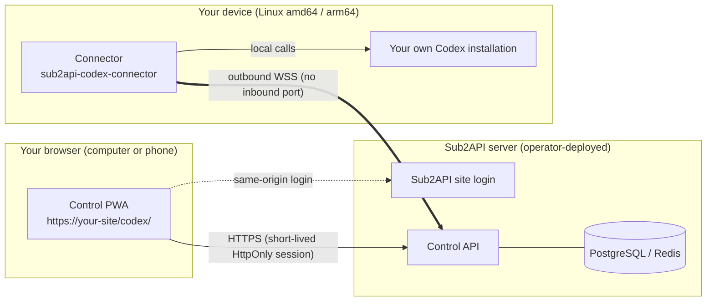
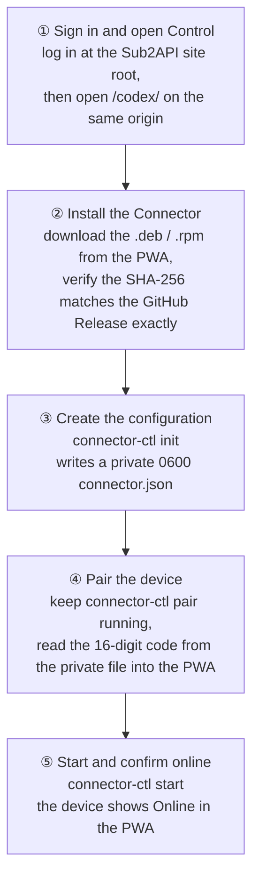
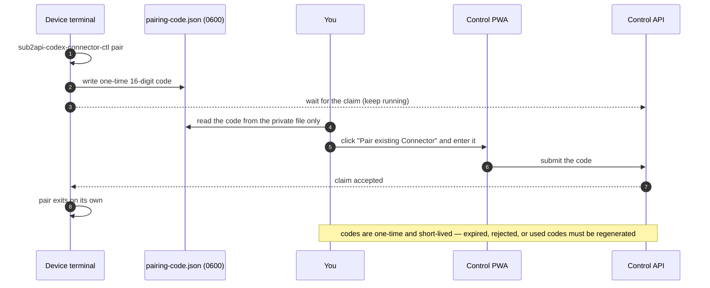
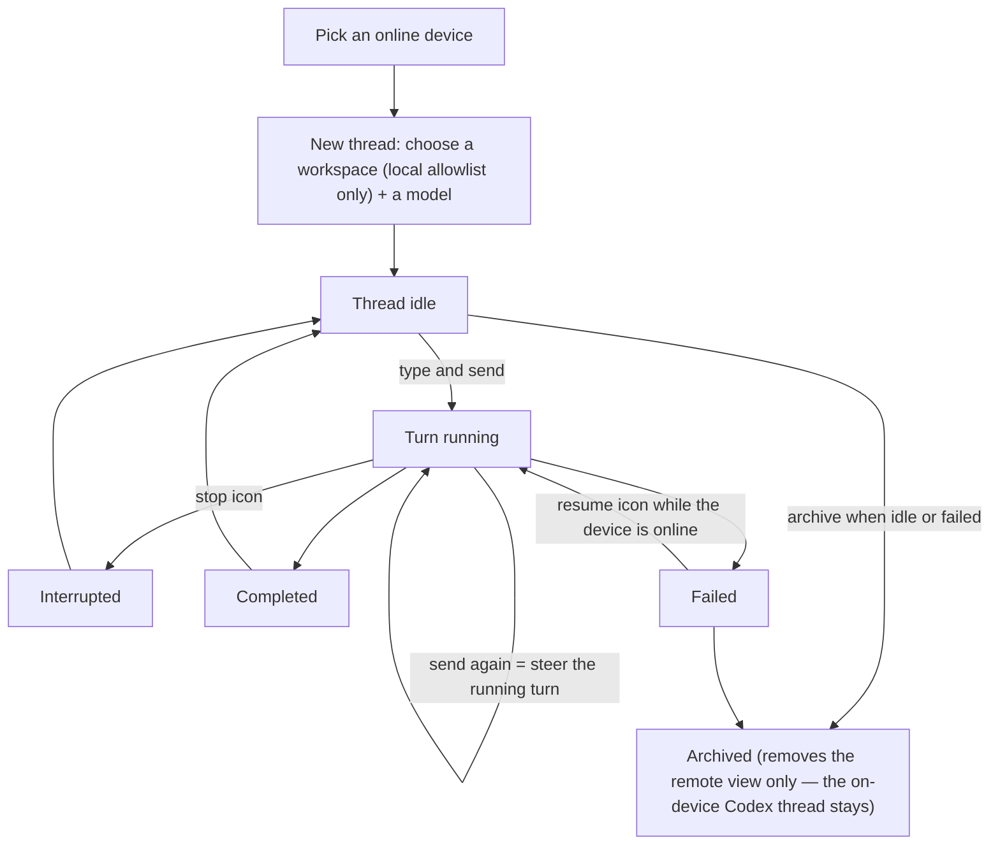
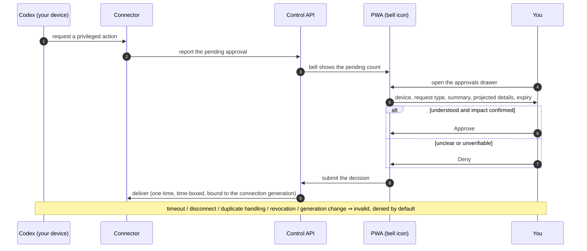
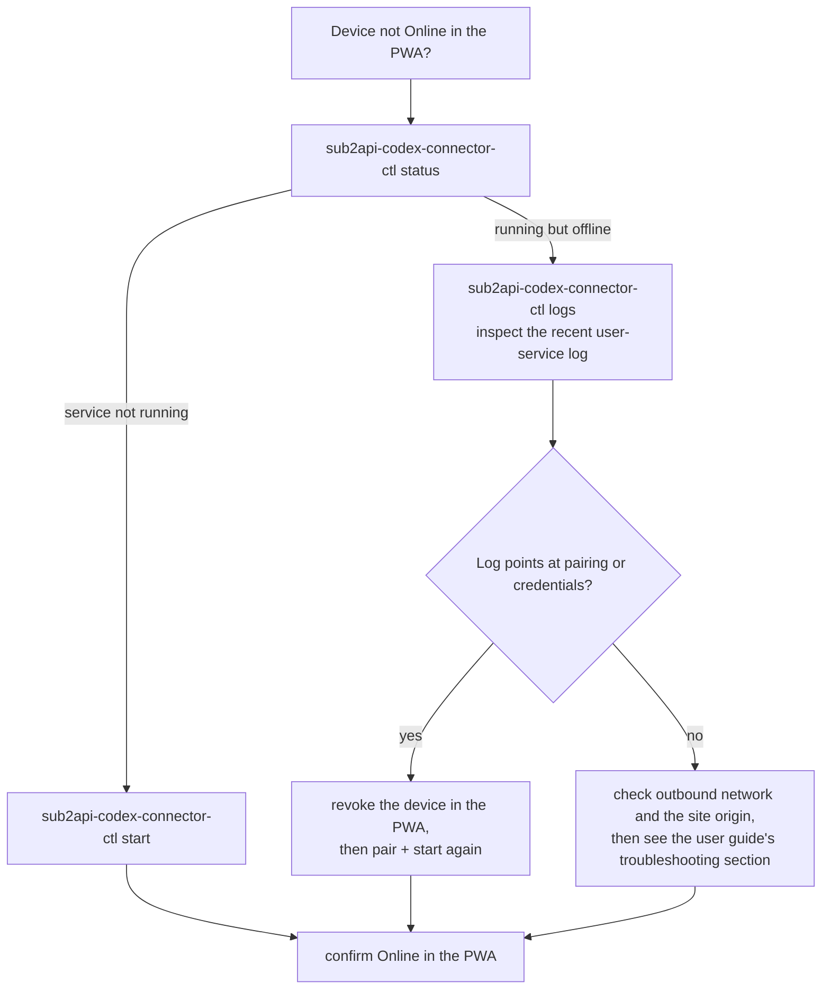
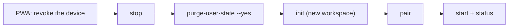

# Visual usage guide

[简体中文](visual-guide.zh-CN.md) · Full text references: [User guide](usage.md) · [Installation](installation.md)

This guide walks you from zero to daily use of Sub2API Codex Control with a diagram for every stage, followed by copy-paste commands. Run every command as the ordinary user who owns Codex; `connector-ctl` refuses root.

## 1. Architecture at a glance

The Connector opens an **outbound** WSS connection only — your device exposes no inbound port, and the browser never talks to your device directly.



Remote capability is fixed to **eight RPC classes** — there is no raw remote shell:

| Class | RPCs |
| --- | --- |
| Models | `model/list` |
| Threads | `thread/start` · `thread/list` · `thread/read` · `thread/resume` |
| Turns | `turn/start` · `turn/steer` · `turn/interrupt` |

## 2. First-time setup journey (5 steps)



Commands per step (replace `https://control.example.com` with your site and use a real absolute workspace path):

```sh
# ③ create the configuration
sub2api-codex-connector-ctl init \
  --origin https://control.example.com \
  --workspace /absolute/path/to/workspace \
  --display-name "My workstation"

# ④ pair (keep it running until the web claim completes and it exits)
sub2api-codex-connector-ctl pair

# ⑤ start and confirm
sub2api-codex-connector-ctl start
sub2api-codex-connector-ctl status
```

> Safety: install only when the tag, filename, and SHA-256 shown by the PWA agree exactly with the [GitHub Releases page](https://github.com/peter2317238492/sub2api-codex-control/releases); read the pairing code only from the mode `0600` `pairing-code.json` — never screenshot it or paste it into chat; never commit or share `connector.json`.

## 3. How pairing completes (sequence)



## 4. Daily use: threads and turns



- The server can never choose a path outside the device-local allowlist, nor raise the sandbox above the Connector's configured cap.
- While a device is offline you can still read recently synced content, but not send, steer, interrupt, or resume.

## 5. How approvals flow (sequence)



## 6. When something goes wrong (decision tree)



Handy commands:

```sh
sub2api-codex-connector-ctl config-path   # where the configuration lives
sub2api-codex-connector-ctl restart       # restart the service
sub2api-codex-connector-ctl logs          # recent logs
```

## 7. Changing workspace, revoking, uninstalling

The formal commands support one workspace at a time; changing it means revoke-and-recreate:



```sh
sub2api-codex-connector-ctl stop
sub2api-codex-connector-ctl purge-user-state --yes
sub2api-codex-connector-ctl init --origin https://control.example.com \
  --workspace /new/absolute/workspace --display-name "My workstation"
sub2api-codex-connector-ctl pair
sub2api-codex-connector-ctl start
sub2api-codex-connector-ctl status
```

To remove everything: **revoke the device** in the PWA first, uninstall the native package (which keeps the private state by default), and only when you are sure you no longer need it, run `purge-user-state --yes` as the same ordinary user. It never deletes Codex configuration, login files, or your workspace.

On shared devices, always sign out with the top-bar logout icon rather than just closing the tab.

---

For the full details (XDG migration, approval semantics, security boundaries, complete troubleshooting) see the [user guide](usage.md) and the [installation guide](installation.md).
