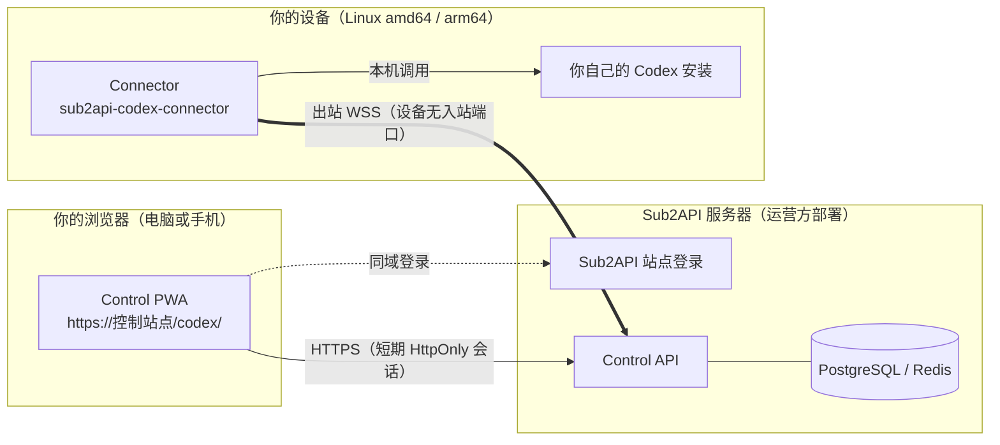
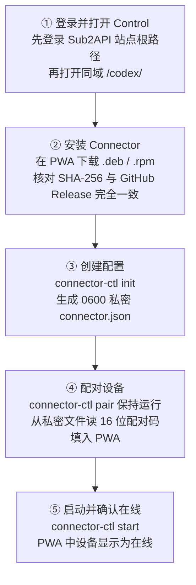
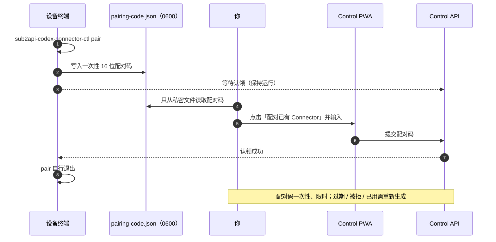
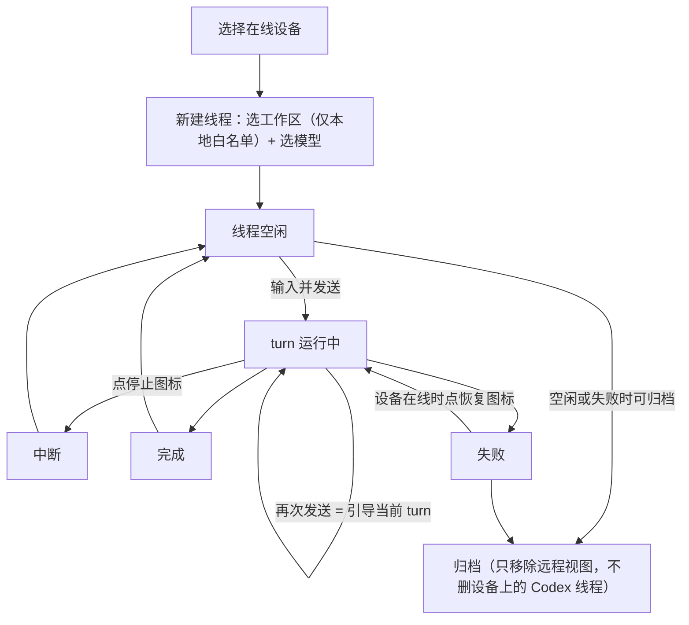
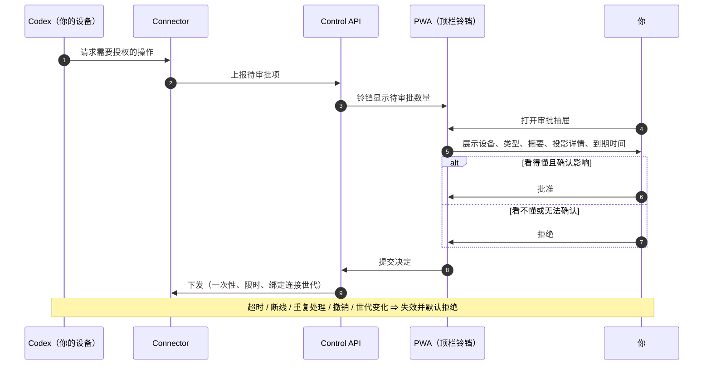
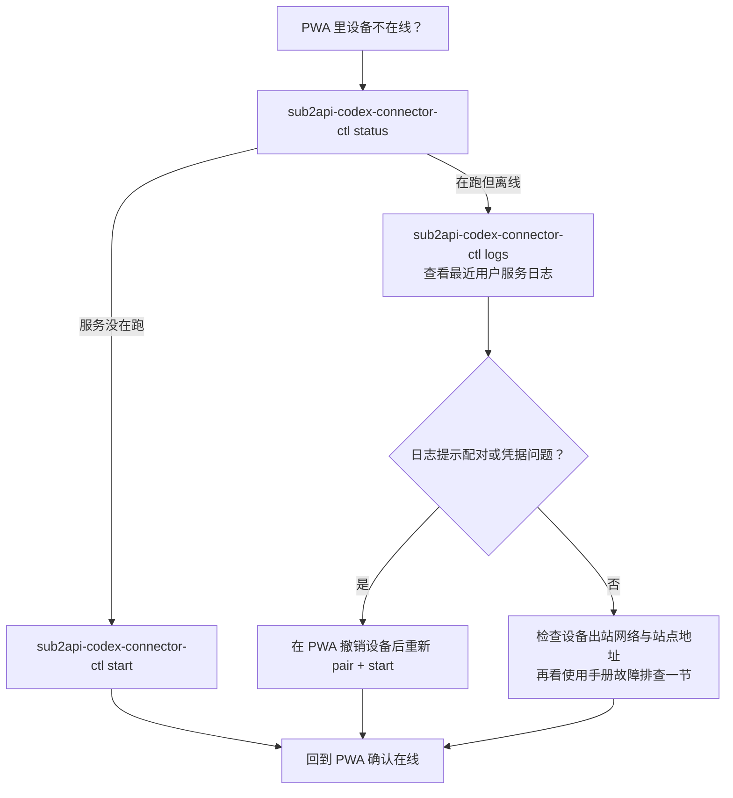
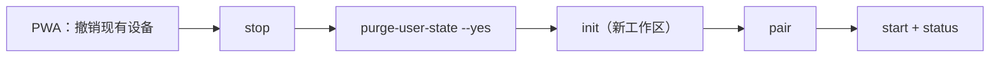

# 图形化使用指南

[English](visual-guide.md) · 详细文字版：[使用手册](usage.zh-CN.md) · [安装指南](installation.zh-CN.md)

本指南用图辅助你从零开始安装、配对并日常使用 Sub2API Codex Control。每张图之后给出可直接复制的命令。所有命令都由拥有 Codex 的普通用户执行，`connector-ctl` 会拒绝 root。

## 1. 架构总览

Connector 只建立**出站** WSS 连接，设备不开放任何入站端口；浏览器永远不直连你的设备。



远程能力被固定为**八类 RPC**，没有原始远程 shell：

| 类别 | RPC |
| --- | --- |
| 模型 | `model/list` |
| 线程 | `thread/start` · `thread/list` · `thread/read` · `thread/resume` |
| 回合 | `turn/start` · `turn/steer` · `turn/interrupt` |

## 2. 首次设置之旅（5 步）



各步命令（把 `https://control.example.com` 换成你的站点，路径换成真实工作区）：

```sh
# ③ 创建配置
sub2api-codex-connector-ctl init \
  --origin https://control.example.com \
  --workspace /absolute/path/to/workspace \
  --display-name "我的工作站"

# ④ 配对（保持运行直到网页认领完成后自行退出）
sub2api-codex-connector-ctl pair

# ⑤ 启动并确认
sub2api-codex-connector-ctl start
sub2api-codex-connector-ctl status
```

> 安全要点：只有 PWA 显示的标签、文件名和 SHA-256 与 [GitHub Releases](https://github.com/peter2317238492/sub2api-codex-control/releases) 完全一致才安装；配对码只从 mode `0600` 的 `pairing-code.json` 读取，不截图、不复制到聊天；`connector.json` 不提交 Git、不外发。

## 3. 配对如何完成（时序）



## 4. 日常使用：线程与 turn



- 服务端无法选择本地白名单之外的路径，也不能把沙箱提升到 Connector 配置上限之上。
- 设备离线时仍可查看最近同步内容，但不能发送、引导、中断或恢复。

## 5. 审批如何流转（时序）



## 6. 出问题时怎么查（决策树）



常用命令备查：

```sh
sub2api-codex-connector-ctl config-path   # 配置位置
sub2api-codex-connector-ctl restart       # 重启服务
sub2api-codex-connector-ctl logs          # 最近日志
```

## 7. 更换工作区、撤销与卸载

当前正式命令一次只支持一个工作区；更换 = 撤销后重建：



```sh
sub2api-codex-connector-ctl stop
sub2api-codex-connector-ctl purge-user-state --yes
sub2api-codex-connector-ctl init --origin https://control.example.com \
  --workspace /new/absolute/workspace --display-name "我的工作站"
sub2api-codex-connector-ctl pair
sub2api-codex-connector-ctl start
sub2api-codex-connector-ctl status
```

彻底移除：先在 PWA **撤销设备**，包管理器卸载后（默认保留私密状态），确认不再需要时由同一普通用户执行 `purge-user-state --yes` 清除 Connector 自有目录。它不会删除 Codex 配置、登录信息或工作区。

共用设备上，请始终用顶栏退出图标显式注销，而不是只关标签页。

---

更多细节（XDG 迁移、审批语义、安全边界、完整故障排查）见[使用手册](usage.zh-CN.md)与[安装指南](installation.zh-CN.md)。
